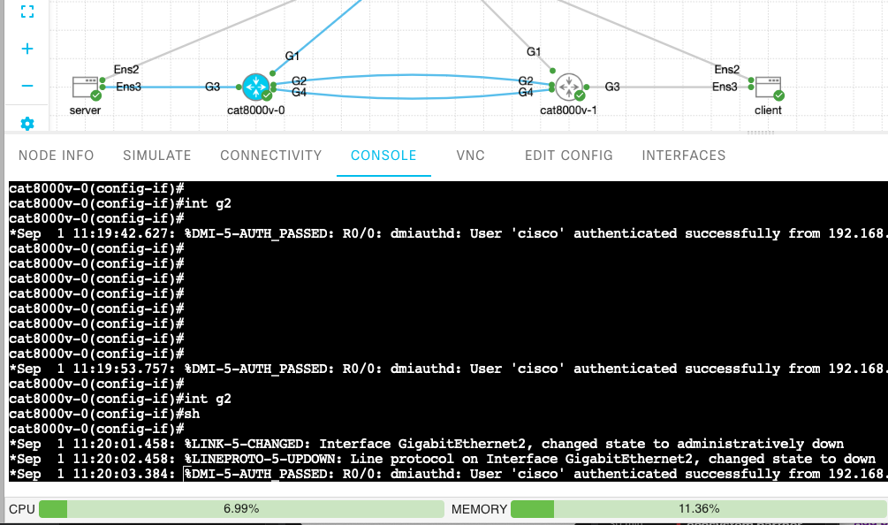
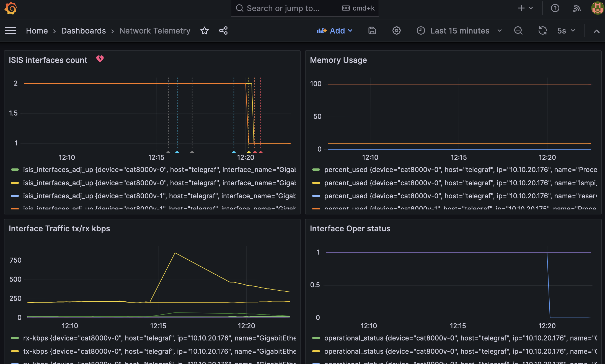
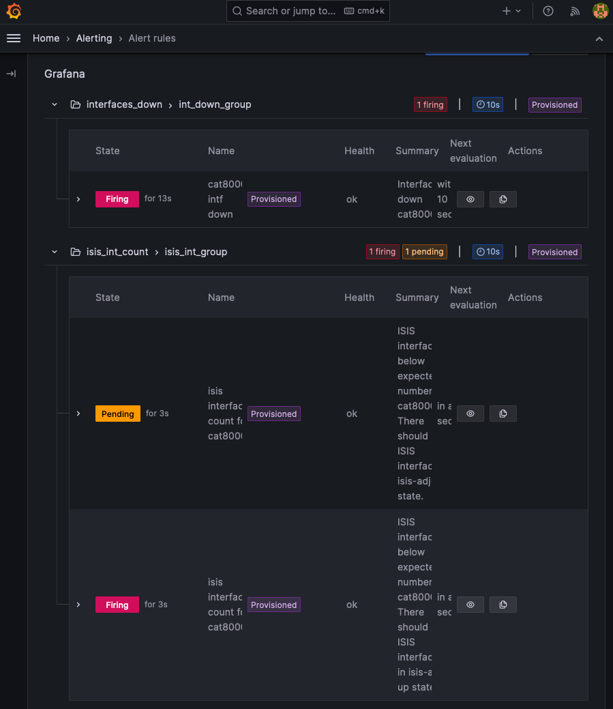

# Open Telemetry Network

[](https://developer.cisco.com/codeexchange/github/repo/jillesca/open_telemetry_network_impact)

> [!IMPORTANT]
> See [AI-Network-Troubleshooting-PoC](https://github.com/jillesca/AI-Network-Troubleshooting-PoC) which is a newer and better version of this demo. No further updates will be done to this repository.

This demo uses the CML sandbox, but technically any IOS-XE device with two ISIS interfaces will work.

Go to [the Devnet sandbox](https://developer.cisco.com/site/sandbox/) and reserve a CML lab.

## Goal

This an exercise to play with AI, specifically OpenAI. The end goal is to get help from AI understanding alarms and giving steps we could do to fix the issue.

These alarms are triggered by Grafana using webhooks. The network data is collected using telemetry data via netconf.

Two alarms [were created for this demo](grafana/alerts.yaml)

- If less than two `ISIS` interfaces are `UP` per device.
- If one interface goes down on any device.

## Prepare Demo

### Start the topology

This lab doesn't use the default topology from the sandbox. We need to remove such lab to avoid IP conflicts.

Either manually stop and wipe the existing lab and then import the [cml topology.](cml/ansible/cml_lab/topology.yaml) Go to CML <https://10.10.20.161> (developer/C1sco12345)

Or run the cml container. _If first time, it will take around 5min to be ready. Manual option could be faster._

> The cml container assumes the default lab is called '_Multi Platform Network_' in cml. If this is not the case, update the [build_run_cml.sh script with the corresponding name](build_run_cml.sh#L24)

```bash
chmod +x build_run_cml.sh
bash build_run_cml.sh
```

Devices used (cisco/cisco):

- 10.10.20.175
- 10.10.20.176

### Start containers on your laptop

First time give executable permissions.

```bash
chmod +x build_run_telegraf.sh
chmod +x build_run_influxdb.sh
chmod +x build_run_grafana.sh
```

Start the containers.

```bash
bash build_run_telegraf.sh
bash build_run_influxdb.sh
bash build_run_grafana.sh
```

> Grafana takes a few seconds to be ready.

### Start the chatbot

Install the dependencies needed.

```bash
pip install -r llm/requirements.txt
```

Add your OpenAI key as environment variable.

If you don't have a key, go to <https://platform.openai.com/account/api-keys>

```bash
export LLM_API_KEY=your_open_ai_key
```

Start the chatbot, keep this terminal open, here you will see the AI notification.

```bash
cd llm/chatbot
python app.py
```

### Verify telemetry on Telegraf, Influxdb, Grafana

- telegraf - `docker exec -it telegraf bash` > [tail -F /tmp/telegraf-grpc.log](telegraf/dockerfile#L30)
- Influxdb - <http://localhost:8086> admin/admin123
- Grafana - <http://localhost:3000/dashboards> admin/admin
  - General > Network Telemetry

## Test the Demo

Start by shutting down an ISIS interface in any cat8000v, in this case `GigabitEthernet 2`



You will see a drop in the grafana dashboard for these metrics, and the alarms will be fired and you will receive a webook on the chatbot.

<http://localhost:3000/dashboards> General > Network Telemetry



<http://localhost:3000/alerting/list>



After a few seconds the AI will receive a webhook, will analyse it and notify you about what happened. Suggesting some actions and tell you a joke to relax a bit.

Currently, it will process every webhook receive and will try to see if the alarms can be related.

#### LLM Analysis Perform

Below is an example of one of the outputs performed by the AI.

    LLM answered: **Alert:** ISIS interfaces count for cat8000v-1
    **Device:** cat8000v-1
    **Grafana Folder:** isis_int_count
    **Host:** telegraf
    **Interface Name:** GigabitEthernet4
    **IP:** 10.10.20.175
    **IPv4 Address:** 10.2.2.2
    **ISIS Down:** int_down
    **ISIS Status:** isis-adj-up
    **Neighbor ID:** 00:00:00:00:00:0b
    **Summary:** ISIS interfaces below expected number for cat8000v-1. There should be 2 ISIS interfaces in isis-adj-up state.

    Thank you for providing the additional information. It appears that we have another issue with the ISIS interfaces, this time on the device cat8000v-1. The expected number of ISIS interfaces in the isis-adj-up state is 2, but the current count is below this expected number.

    To troubleshoot this issue, we can start by checking the configuration of the device and verifying if all the necessary ISIS interfaces are properly configured. Additionally, we should also investigate if there are any errors or issues reported on the GigabitEthernet4 interface.

    Here are the details of the affected device and interface:

    | Device Name | IP Address   | Interface        |
    | ----------- | ------------ | ---------------- |
    | cat8000v-1  | 10.10.20.175 | GigabitEthernet4 |

    Please review the configuration and status of the ISIS interfaces on cat8000v-1, and check for any errors or issues on the GigabitEthernet4 interface. If you need further assistance, please let us know.

    And now, here's another joke for network engineers:

    Why was the network engineer always calm?

    Because they had excellent network latency!

## Use your own devices

If you want to use your own devices, you only need to tell the [netconf client](netconf_client) which devices it has to query and their credentials.

To add your devices [create a configuration file under the devices directory.](netconf_client/devices/) Follow the structure of the existing files.

Then you need to tell telegraf, which configuration file it should use under [netconf.conf file](telegraf/netconf.conf#L2)

Rebuild the container using `bash build_run_telegraf.sh`

## Tear down the lab

Remove any containers from your laptop with the commands below

```bash
docker rm -f cml telegraf influxdb grafana
docker volume rm influxdb
```

## .env.local file

The [.env.local file](.env.local) is used to define all variables used by the containers.

On a real implementation you will keep this file out of git using the `.gitignore` file, but since this is a demo, is used to provide everything you need to run the demo, except the `LLM Key.`

## Troubleshooting

Sometimes the CML lab is not reachable from your laptop. When this happens usually is a connectivity issue between the devices and the bridge of CML.

- One way to fix this issue is to flap several times the management interface (G1) of the devices.
- Ping from the devices to their Gateway (10.10.20.255)
- Go to the DevBox 10.10.20.50 developer/C1sco12345 and ping the managment interface of the devices

Usually after around 5 minutes the connectivity starts to work.

In more drastic cases, restart the cat8kv from the CML GUI.

## Links that helped to build the lab

- <https://github.com/jeremycohoe/cisco-ios-xe-mdt/tree/master>
- <https://anirudhkamath.github.io/network-automation-blog/notes/network-telemetry-using-netconf-telegraf-prometheus.html>

## Find which subscriptions could be on-change

Use `show platform software ndbman ...` and autocomplete for your device.

On the lab you can use

```bash
show platform software ndbman R0 models | inc Emul|no
```
